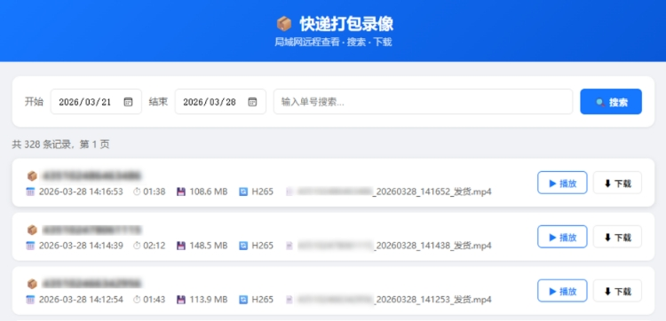
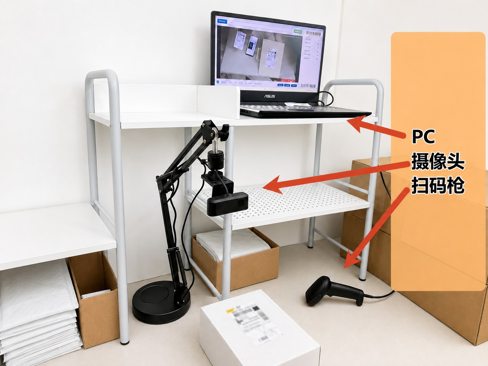

#  快递打包监控

简体中文 | [English](README.en.md)

面向电商卖家和打包工位的录像与发货风险拦截工具。扫码自动录像，联动快递助手播报买家留言和卖家备注；面单打印后发生退款，也能在发货前及时报警拦截

> 不只在售后提供录像证据，也在打包过程中提醒特殊要求、拦截退款订单，减少错发、漏发和退款后发货

## 适合谁用

- 使用快递助手打印面单，希望直接联动现有工作流程。
- 担心面单打印后订单发生退款，仍被打包发出。
- 需要在打包时播报买家留言、卖家备注或商品信息。
- 想扫码自动录像，并按快递单号快速找到对应录像。
- 想让手机或其他电脑在局域网里查看录像。
- 想在网页端剪掉录像开头或结尾后再下载。
- 磁盘空间有限，希望旧录像能自动清理，同时给系统保留空间。

## 主要功能

- 联动快递助手同步订单，在打包时语音播报买家留言、卖家备注和商品信息。
- 扫码后异步核验打印后退款，发货和退货模式均可按退款状态报警，且不影响录像。
- 摄像头可自动识别面单一维条形码并开始录像，将打包过程与快递单号关联。
- 主画面中央引导框用于稳定识别；未录像时会低频检查全画面，录像中只识别引导框，降低商品条码误触风险。
- 扫码枪与摄像头识别可以同时使用，扫码枪继续作为后台扫码和故障后备方案。
- 支持摄像头录制、声音录制和录像水印。
- 录像列表可按单号搜索，也可通过网页回放。
- 网页端支持“剪辑并下载”，可选择保留的时间范围。
- 支持多个保存位置，按预留空间规则自动切换磁盘并清理旧录像。
- 支持启动器自动检查更新，下载并校验增量更新包后，下次启动自动安装；手动下载的增量包也可完整解压后双击 CMD 安装。

## 需要准备

- Windows 10/11 x64 电脑
- USB 摄像头
- 键盘模式的扫码枪（可选，建议保留作后备）

推荐下载 `ExpressPackingMonitoring_Setup_vX.Y.Z.exe` 安装向导。安装器无需管理员权限，会固定安装到当前用户目录并创建开始菜单快捷方式，桌面快捷方式默认勾选。完整 ZIP 是免安装和故障恢复方式。两种发布包通常都不需要额外安装 `.NET` 和 `ffmpeg.exe`；从源码运行或二次开发需要安装 `.NET 8 SDK` 和 `ffmpeg.exe`（推荐使用 Full 版本）

## 快速开始

1. 打开软件，进入设置页。
2. 选择摄像头和麦克风。
3. 设置录像保存位置和给系统预留的磁盘空间。
4. 将面单条形码放入主画面引导框，稳定识别后自动开始录像；也可以继续使用扫码枪。
5. 发货或扫描停止指令后结束录像。
6. 需要查看时，在录像列表里输入快递单号搜索。

摄像头空闲休眠后，单纯放入面单不会自动唤醒。请先点击软件、按键或使用扫码枪唤醒摄像头，再将面单放入识别框。

## 软件更新

- 日常使用请从安装器创建的快捷方式或安装根目录的 `ExpressPackingMonitoring.exe` 启动。启动器会在后台下载经过校验的增量包，并在下次启动时自动安装。
- 手动下载增量包时，先完整解压，再双击包内的 `双击安装增量更新.cmd`。脚本会优先从用户配置中读取原 `app` 目录；无法自动定位时，可按提示拖入完整包根目录、`app` 目录、项目程序或指向这些目标的 `.lnk` 快捷方式。失效、循环、网络快捷方式和非本项目程序会说明原因并允许重新拖入。
- 如果增量包提示安装版本低于补丁基线或本次必须更新启动器，请优先运行新版 Setup 原位覆盖升级，也可使用完整 ZIP 故障恢复。旧免安装目录不会自动迁移或删除；不要删除 `%LOCALAPPDATA%\ExpressPackingMonitoring\`，配置、数据库和录像记录会继续保留。

## 卸载与数据

- 卸载默认保留配置、数据库、日志、缓存和所有录像。
- 卸载器会分别询问是否删除本机应用数据、是否删除数据库登记的录像原文件，两项默认均为“否”。
- 选择删除录像后会先显示文件数量和总容量，再要求第二次确认；只处理数据库登记且确认后没有变化的精确文件，不扫描扩展名、不清空录像目录。
- 数据库缺失、损坏、占用或任何录像清理失败时，录像和本机应用数据会保留，详情记录在系统临时目录的卸载日志中。

## 局域网回放

1. 在设置页开启 Web 服务。
2. 保存设置并重启软件。
3. 同一局域网设备访问 `http://电脑IP:5280`。

如果系统弹出防火墙提示，请允许访问。

## 订单备注播报

需要配合浏览器脚本使用：

1. 安装 Tampermonkey 或 Violentmonkey。
2. 安装仓库里的 `Scripts/快递助手订单推送.user.js`。
3. 打印页面打开或订单变化时，脚本会自动把当前订单信息发送给监控端，不需要保持退款工作页供普通订单使用。
4. 监控端收到订单后，可播报备注和商品信息。
5. 如需打印后退款报警，请保持一个已登录的快递助手批量打印页面打开。脚本会在后台打开不抢焦点的“退款核验工作页”，只有该专用页面会切换“打印后退款”筛选，用户正在操作的打印页面不会被切换。
6. 监控端扫码后会立即录像并异步请求退款数据。工作页先回传当前退款列表；目标单号不在列表中时，再按快递单号精确查询历史订单。查询失败或打印端暂时离线时，监控端使用 SQLite 中最近 90 天的订单数据降级核验。

退款核验工作页有专用标题和半透明遮罩，请勿在该页面手动操作；误关后脚本会自动重建，也可从扩展菜单手动打开。脚本首次连接新的监控端地址时，如果浏览器询问跨源访问权限，应确认目标地址是本机或可信局域网内的监控工位后再允许；从监控端安装向导重新安装脚本，可自动加入当前工位的精确访问权限。

重复单号从录像数据库中检查最近 30 天的未删除记录，不依赖浏览器订单缓存。订单及退款缓存也统一保存在 SQLite 中，旧的 `orderinfo_cache.json` 仅在升级时迁移，迁移完成后会删除。

## 录像保存

软件会把配置、数据库、日志和录像保存在本机用户数据目录中。升级软件时，只要不删除用户数据，原来的配置和录像记录会继续保留。

存储管理里设置的是“预留空间”：磁盘低于这个剩余空间时，软件会停止往该磁盘继续写入新录像，并优先切换到下一个保存位置。系统盘会自动保留更高的安全空间，避免影响 Windows 和其他软件运行。

## 许可证

本项目使用 [AGPL-3.0 License](LICENSE) 开源。

个人学习、自家店铺自用可以免费使用；如果修改后对外分发或提供网络服务，需要遵守 AGPL-3.0 的开源要求。

